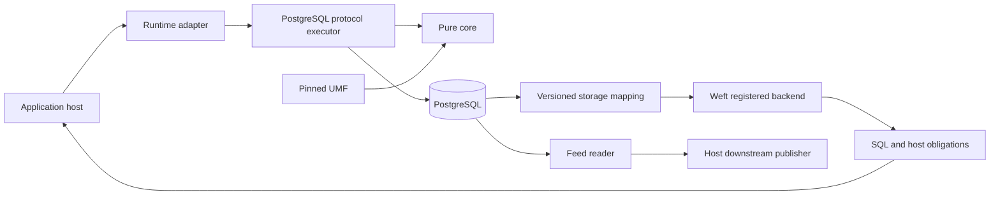

---
ddx:
  id: truss.architecture
  type: architecture
  activity: design
  status: draft
  authoring:
    home: repo
  links:
    - id: truss.prd
      kind: informed_by
    - id: truss.concerns
      kind: informed_by
    - id: ADR-001
      kind: informed_by
    - id: ADR-002
      kind: informed_by
    - id: ADR-003
      kind: informed_by
---

# Truss architecture

## Scope

Truss is an embeddable property-graph storage toolkit and a first TypeScript reference implementation over PostgreSQL. It consumes UMF meaning and exposes a versioned storage contract to Weft. The host owns deployment, authentication, connections and transaction lifetime. Public requirements and contracts remain drafts; this architecture does not approve them or claim implemented support.

UMF is the machine-readable metamodel and schema interchange fabric. Weft owns source SQL semantics, logical query planning and compiler embedding. Truss owns physical graph storage, catalog acceptance, write enforcement, history and execution obligations. A reference Truss implementation is a consumer of UMF, not UMF's semantic authority.

## Level 1: System Context

| Participant | Responsibility | Boundary |
| --- | --- | --- |
| Application host | Supplies schemas, connections, asserted actor and policy; commits caller transactions | Embedded library calls |
| UMF | Versioned schema validity, types, keys, relationships and retained meaning | Explicitly supplied pinned documents/library |
| Weft | Parse/resolve SQL, assess capabilities, lower and emit through a backend | Pinned model and physical mapping; compilation artifact |
| Truss | Catalog, storage, mutations, reports, history, read context and embedding/tooling boundaries | CONTRACT-001 through CONTRACT-011 |
| PostgreSQL | Transactions, keys, endpoints, row locking and optional role isolation | Adapter-owned parameterized statements |
| Downstream consumer | Applies feed records and reports durable position | CONTRACT-006; transport is host-owned |

## Level 2: Containers and Packages

These are in-process packages, not required services. ADR-001 governs TypeScript first, separate packages and the host-neutral core. Package names below are proposed workspace locations, not published package identifiers.

| Package | Responsibility | Allowed dependencies |
| --- | --- | --- |
| `packages/core` | Exact codecs, UMF portable-key API integration, selected storage-key profiles, catalog-derived validation, operation planning and diagnostics | Pinned UMF library; no I/O or host globals |
| `packages/postgresql` | SQL templates, catalog persistence, write/lock protocol, decoding and mapping export | Core and abstract transaction executor |
| `packages/adapter-bun` | Bun connection and exact text transport | PostgreSQL package; Bun APIs |
| `packages/adapter-pg` | Node/PostgreSQL driver and exact text transport | PostgreSQL package; Node APIs |
| `packages/tooling` | Layout generation/checking and explicit administrative operations | Host APIs; never imported by core |
| `packages/conformance` | Language-neutral fixtures and evidence runner | Runtime adapters in harness only |

The reference implementation assembles these packages. A second implementation follows the contracts and corpus under proposed ADR-003; no Rust port of Truss follows automatically from Weft's Rust choice.

The proposed `createReferenceAssembly` construction/lifetime export belongs to `packages/postgresql` as a driver-neutral composition entry point. It consumes the abstract executor and core profiles; it imports neither runtime adapter, tooling nor conformance runner. Bun/Node adapters are separately imported and supplied by the host. The reference application is a consumer example, not an additional privileged library layer: it imports public exports, supplies credentials/connections/authentication and explicitly invokes optional tooling/workers. Administrative/bootstrap exports remain in tooling; importing the composition entry point cannot transitively initialize them. Core export consumption in Chromium remains independent of PostgreSQL assembly/native qualification.

### Public capability inventory

The [package delivery design](package-delivery.proposal.md) allocates emitted exports, dependency closures, the packed reference consumer and PD-01–08 acceptance schedules. Published package names and adapter runtime profiles remain unselected.

Initial package-format candidate: emit ESM JavaScript targeting ES2022 with matching `.d.ts` declarations and explicit `exports`/type entry points. Publish compiled artifacts rather than requiring consumers to compile workspace TypeScript. Browser core, driver-neutral PostgreSQL assembly and Bun/Node adapters retain separate entry points and dependency closures. Data contracts/corpus artifacts use explicit data exports and exact version/digest inventories; importing an executable entry point does not eagerly load all corpus/native-model data. Native database support still follows selected adapter/server profiles rather than the JavaScript target. This is a draft packaging choice, requiring public API/build review and independent loader evidence before release; CommonJS or other loader profiles need their own selected build/evidence and are not inferred from ESM tests.

These are planned embeddable capability families. Draft bindings name proposed exports; they do not imply published packages, existing runtime code or release qualification. Hosts assemble the families they use; administrative operations are explicit tooling, not automatic library startup effects.

| Capability | Owning package / contract | Reviewable inputs and required outcome |
| --- | --- | --- |
| Physical layout generation, comparison and fresh installation | tooling; CONTRACT-008 | Pinned UMF native model/bundle; complete object coverage, parity and qualified installation outcome |
| Catalog acceptance and exact repeat detection | core + postgresql; CONTRACT-003 | Complete acceptance-input pins/artifacts; atomic report/head/data effects, preserved origin on repeat |
| Exact value validation and key encoding | core; CONTRACT-001/010 | Pinned definitions and tagged carriers; preserved presence/lexical meaning, explicit unsupported diagnostics |
| Single mutations, atomic groups and identity-based imports | core + postgresql; CONTRACT-004/009 | Qualified transaction/role context; ordered semantic results and complete rollback/progress/durability outcomes |
| Host transactions and driver adapters | adapter-bun/adapter-pg; CONTRACT-007 | Connection-affine scopes; pending/committed/unknown outcomes and confirmed cleanup |
| Direct reads, pages, traversal and catalog enumeration | postgresql + core; CONTRACT-004 | Authorized read context; exact results, bounded work, cursor consistency and named semantic profile |
| Weft mapping and compiled-artifact execution integration | postgresql; jointly pinned Weft contracts | Storage mapping plus qualified host obligations; compiler remains Weft-owned |
| History, seed, feed and consumer progress | postgresql + core; CONTRACT-002/006 | Complete event/definition context; honest reconstruction, resumable delivery and durable checkpoint/retention behavior |
| Optional module isolation and historical disclosure policy | tooling + postgresql; CONTRACT-005 | Qualified ownership/grants/policy bundle; enforced live and retained-context authorization |
| Enforcement reports, conformance and support receipts | core + conformance; CONTRACT-004/011 | Complete assertion/case manifest and trusted evidence; no upgrade of partial/stale/unverified guarantees |
| Declared index/statistics jobs and retention maintenance | tooling; CONTRACT-003/006 | Confirmed commit, administrative authority and owned-resource evidence; readiness separate from catalog acceptance |

Request-free groups, direct reads and journal observations can be developed independently, but their partial readiness does not close full replay, compiler integration or complete-feed requirements. Current draft bindings and wires cover execution, acceptance, mutation/group/import, direct/compiled reads, journal/history/feed and explicit tooling. Complete original native/producer/resource/authority admission and joint owner reviews remain explicit design work; wire coverage does not prove execution readiness. No capability family supplies an alternate UMF validator/resolver or a Truss SQL source compiler.

Backend lowering belongs at Weft's registered backend boundary. Truss supplies its storage-profile definition, mapping export and database/result evidence. Distribution of the Rust backend is a joint packaging decision; Truss core must not acquire another SQL parser or logical optimizer.

Reference assembly construction and disposal do not register/unregister a global Weft backend or own a compiler runtime. A host may supply a separately configured compiler/backend and execution artifact under the jointly pinned integration profile, or consume Truss direct APIs with no compiler present. Compiler host lifetime remains host-owned. Before executing a compiled artifact, Truss verifies the complete artifact/mapping/model/value/decoder/obligation pins against its admitted target and read context; factory configuration or readiness cannot discharge that check. Missing required obligations refuse before SQL submission, and assembly shutdown applies the same native cancellation/quarantine protocol as direct operations. Unregistering an optional compiler backend cannot change stored graph/catalog meaning or disable unrelated direct capabilities.

## Proposed tooling export and dependency map

This map assigns the authored declarations to the existing six-package design. It is a build handoff, not a new package or final npm subpath decision. All configuration/selection is captured without startup effects; data-call authority and native evidence remain per invocation.

| Proposed public surface | Package implementation owner | Required dependencies / remaining closure |
| --- | --- | --- |
| [viewNumericAsNumber](contracts/bindings/truss-core-v0.1.d.ts) | core | Standalone exact-token convenience under fixed qualified numeric own-work profile; internal operations reuse the same conversion with their enclosing account. No Field/native admission, caller budget override, I/O or host globals. Declaration is authored; parser/resource producer and packed browser evidence remain open. |
| [createFeedCapabilityV02](contracts/bindings/truss-feed-key-transition-v0.2.d.ts) | tooling | Existing assembly and exact v0.2 feed selection plus explicit host verifier registration; inert projection with per-call native/custody admission. Old assembly facade stays unchanged. Full lifecycle/worker/seed/native profiles remain open. |
| [registerFeedHostCompositionV02](contracts/bindings/truss-feed-host-composition-v0.2.d.ts) | tooling | Existing assembly and complete versioned host service/seed/source-procedure tuple; inert atomic registration returns original opaque custody, without worker startup or readiness claims. Lifecycle projection and native profiles remain open. |
| [createFeedLifecycleToolingV02](contracts/bindings/truss-feed-lifecycle-v0.2.d.ts) | tooling | Exact existing assembly plus original opaque v0.2 host registration; all lifecycle facades preserve versioned progress, start no services and retain current native admission. |
| [createFeedLifecycleTooling](contracts/bindings/truss-feed-tooling-v0.1.d.ts) | tooling | Existing PostgreSQL reference assembly; exact feed selection; source administration/registration/worker/seed methods; downstream services remain host calls. Native lifecycle profiles and packed consumers remain open. |
| [BootstrapGenerationTooling.generate](contracts/bindings/truss-bootstrap-generation-v0.1.d.ts) | tooling | Selected existing UMF guarded statement-node export and Truss-owned complete original statement/effect composition. UMF is sufficient for the current scope; generated/native parity and complete Truss inventory remain Truss obligations. Construction/backend containment/resource profiles remain open. No database dependency for generation. |
| [createBootstrapInstallationTooling](contracts/bindings/truss-bootstrap-installation-v0.1.d.ts) | tooling | Existing assembly/executor/host registry; bootstrap selection; namespace/admin/native inventory procedures. No implicit generation or installed-state promotion. |
| [createPhysicalOptimizationTooling](contracts/bindings/truss-physical-optimization-v0.1.d.ts) | tooling | Existing assembly, current native inventory/exclusion, exact declaration and measured budget profiles; UMF/Weft mapping only where selected typed views require it. No compiler owned by tooling. |
| [createKeyProfileMigrationTooling](contracts/bindings/truss-key-profile-migration-v0.1.d.ts) | tooling | Existing assembly and exact source/target bootstrap transition selection; administrative native exclusion, complete key/reservation inventory, original recovery custody and atomic installed-binding switch. Construction is inert; migration does not change captured assembly selections. |
| [registerReceiptObservationCoordinator](contracts/bindings/truss-receipt-observation-coordinator-v0.1.d.ts) | tooling | Inert original host service/profile/composition registration; opaque assembly-bound issuer custody. Native caller/policy/namespace/route/cut admission and service release remain per-call obligations. |
| [createReceiptLifecycleTooling](contracts/bindings/truss-receipt-lifecycle-tooling-v0.1.d.ts) | tooling | Existing group selection and original namespace/native clock/retention/archive/procedure/resource/observation composition; inert protection plus expiry tooling. Read-only observation requires its separately registered original coordinator profile; no implicit service or twelfth capability family. |
| [createRetentionTooling](contracts/bindings/truss-retention-tooling-v0.1.d.ts) | tooling | Exact feed selection, current consumer/seed/history/replay dependency enumeration and shared native retention exclusion; supplied-scope drop/horizon changes stay pending. No scheduled job is started. |
| [createConformanceRunTooling / HostConformanceRunner](contracts/bindings/truss-conformance-tooling-v0.1.d.ts) | conformance harness; host supplies actual runner | Inert original runner/resource/composition binding, host-approved manifests/environments, explicit prepare/original-run/reconcile/abandon. Opaque prepared custody and original recovery precede effects. Native producer/store/containment/resource and packed consumers remain open; no implicit test startup or host shutdown. |
| [registerOperationArbitration](contracts/bindings/truss-operation-arbitration-v0.1.d.ts) | postgresql protocol integration; host supplies original shared service | Existing assembly plus original cross-assembly executor/transaction arbitration domain and exact composition/resource/coordination/recovery profiles. Inert registration; private prepare/acquire/observe/release/abandon and assembly admission closure preserve original custody. Native host coordination/producer/accounting and actual package integration remain open. |
| [createConformanceEvidenceTooling](contracts/bindings/truss-conformance-tooling-v0.1.d.ts) | conformance | Inert host assessor binding and nonempty immutable approved manifests. Independent receipt/result custody and exact resource/qualification profiles remain open. |
| [registerCatalogTransform](contracts/bindings/truss-catalog-transform-v0.1.d.ts) | postgresql protocol integration | Inert assembly-scoped transform custody under the original catalog selection; invokes no callback or native validation. Host owns callback implementation; exact transform/native profile and lifecycle remain required. |
| [registerTraversalStageService](contracts/bindings/truss-traversal-stage-service-v0.1.d.ts) | postgresql protocol integration | Inert original host-stage service registration; no service invocation/readiness or hidden temporary-store construction. Native stage lifetime, authority, held-snapshot and cleanup profiles remain required. |
| [createPhysicalJobTooling](contracts/bindings/truss-physical-job-tooling-v0.1.d.ts) | tooling | Inert administrative facade for original registered index/statistics job services; explicit admission/committed observation/attempt operations retain their governing boundaries. No import-time jobs. |
| [registerPhysicalJobService](contracts/bindings/truss-physical-job-tooling-v0.1.d.ts) | tooling | Inert exact host service/configuration registration; host owns native job/queue/recovery implementation. Registration is neither job admission nor committed readiness. |
| Public value/profile/operation/receipt declarations | core | Browser-compatible driver-free types and governing wire/admission semantics. Type-only reference composition does not import a runner, database driver or UMF backend. |

Core and the PostgreSQL assembly must not transitively import tooling or conformance implementation. Tooling may consume assembly types/public methods, and conformance harnesses may explicitly consume public adapters to execute tests. Runtime adapter imports remain separately host-selected. Generation uses UMF ownership; typed view compilation uses Weft ownership. Host authentication/credentials, pools, recovery custody and downstream storage remain injected services with their explicit lifetime contracts. Runner/assessor objects and manifests cannot acquire trust merely by satisfying TypeScript interfaces.

Before publishing exports, run package-consumer checks from installed/packed package boundaries and prove the static import graph excludes host-native APIs from browser core. Driver-neutral TypeScript compilation currently establishes declaration consistency only; it does not prove package packing, module initialization behavior, browser execution or native qualification. Retention-maintenance declaration is now explicit; its native profiles and module-isolation administrative orchestration retain their governing design gates rather than be implied by this map.

## Deployment

The library runs in the application's Bun/Node process against an embedded or server PostgreSQL. Runtime connections and pool limits belong to the host. Transaction-mode pooling requires transaction-local state only. Browser verification covers the pure core; database adapters run on supported server runtimes. Backup, recovery objectives and managed-service deployment are host decisions with separate evidence.

## Data Flow

For a write, the executor uses the caller's transaction or opens its own. It reads configured journal mode and locks the catalog head, verifies the pinned revision, acquires the required row locks, validates, persists canonical data and journals atomically. It returns provisional effects to a caller-owned transaction; only the host's commit makes them durable. Core planning never commits or retries a host transaction.

For a query, a host supplies Weft with model bytes and a storage mapping for one accepted revision. Compilation yields SQL, exact parameters, decoders and obligations. The host/adapter establishes the matching read context and role, checks obligations, executes parameterized SQL and decodes without host numeric rounding. Read-context pinning must detect stale mappings and does not imply stable pagination across separately committed transactions.

For catalog acceptance, validation can precede the catalog lock; derivation, tightened-rule checks, transforms, journal and head update are atomic under it. No per-type DDL is introduced. Declared indexes build after commit with pending/failed state reported.

## Quality Attributes

| Attribute | Target | Verification |
| --- | --- | --- |
| Fidelity | No silently dropped fields or unknown model content; exact stored values within the qualified encoding | Value/retention corpus and independent database checks |
| Integrity | Keys/endpoints enforced on engine bypass; engine-only rules identified honestly | Plain-SQL bypass and concurrent-client tests |
| Embedding | Caller transaction controls host and Truss effects together | Commit/rollback/savepoint/fault cases |
| Performance | PRD targets remain proposed; no broader scale claim | ADR-002 V1–V7 and qualified benchmarks |
| Portability | Pure core has no Bun/Node imports; Node support remains provisional | Browser core checks; Bun/Node fidelity gates |
| Evolution | Layout, model, binding and compiler versions are independent and pinned | Stale/mismatched context refusal cases |

## Decisions and Tradeoffs

ADR-001 and ADR-002 are accepted. ADR-003 remains proposed. Fixed storage and per-property logical semantics coexist with object-level physical writes. Optional journal triggers strengthen bypass coverage; engine mode is narrower. Host extensions cannot alter Truss columns or constraints. Unsupported property homes or selected semantics refuse explicitly.

## Design Gates

[Design coordination](../04-build/design-coordination.md) owns the remaining design queue. Before a public embedding API, specify transaction failure/savepoint semantics and group lock planning. Before Weft integration, reconcile document-qualified logical identity with the current catalog uniqueness rule. Before feed qualification, define complete historical envelopes, replay identity, snapshots and retention interaction. Upcoming UMF capabilities are versioned dependencies, never implicit promises.

## Reference host parity and packed delivery

The reference host is an application of the public toolkit, not a privileged second implementation. Its scenario runner imports the exact packed package exports selected for a release candidate and supplies host-owned connections, authentication context, transaction lifetime, recovery registry and optional Weft compiler. It must not import workspace-private native routines, reach into core internals, write protected graph stores directly, create an alternate validator/encoder or generate a separate compiler mapping. Administrative installation uses the same separately selected tooling boundary that an external host invokes. Reference-only fixture seeding bypasses cannot establish a public mutation criterion.

Build conformance uses a clean consumer directory with installed packed artifacts and explicit selected dependency closure, rather than repository path aliases or sibling source imports. The UMF source-tooling selection remains its separately pinned build dependency; a source-only helper path cannot accidentally become a portable-core runtime import. Weft compiler/backend runtime is host-injected and optional for direct capabilities; its presence or absence must not change mutation, direct-read or disposal semantics. Backend distribution/ABI adoption still requires joint selection, not a new Truss package parser.

Capture separate consumer receipts for the portable core in an actual browser, the selected Bun reference host, and any separately claimed Node/driver adapter subset. Bun passes do not qualify browser or Node support; the provisional Node target remains unclaimed until its own checks. Inspect transitive runtime imports and exported declarations as well as emitted bytes: a browser-compatible entrypoint with a hidden Bun/Node dependency is not portable. Package constructors/imports remain inert; capability calls follow existing native adoption and per-call admission.

Every runnable reference scenario binds the original fixture/catalog/layout/value/key/policy and compiler mapping artifacts, expected outcomes and exact host composition. The runner preserves pending/committed/unknown results and host recovery references instead of flattening them into generic success/failure. It closes new admission before disposal, reports quarantined resources and leaves the host-owned recovery registry usable after assembly release. Cleanup proves ownership of its isolated resources and original transaction termination before removal; generated schema names alone cannot authorize dropping resources.

### Original-definition handoff package ownership

The property-definition handoff preserves the existing package boundary. Core may admit bounded original UMF/catalog/profile/artifact metadata and assemble an immutable candidate using existing owner APIs, with no connection acquisition, SQL, native catalog inspection or compiler initialization. It retains the complete source inputs; Weft's frontend remains responsible for logical SQL/descriptor resolution. Core does not implement an alternate descriptor resolver or import Weft's Rust/WASM compiler transitively.

The PostgreSQL package owns original physical inventory/selector correspondence and mapping export through the supplied abstract executor, with explicit native context/authority/resource producers. Driver adapters supply transport/termination only under their selected profiles. A selected host may register the resulting immutable original definition set with Weft through the compiler owner's integrated bridge; invoking compilation is explicit host orchestration, not assembly construction or an automatic adapter side effect. Compiled execution consumes the original artifact and enforces its obligations under the existing ABI.

The reference example demonstrates metadata admission, explicit native mapping readiness, optional explicit compilation and original artifact execution as separate calls through public exports. Preserve one original binding/source/profile basis across those stages. Planning candidates can be built before native readiness but cannot register native support or execute by relabeling a candidate. Missing or changed basis/authority/profile refuses at the responsible boundary. This adds no new public methods, backend global registration, package identifiers or cross-owner compiler API assumption.

### PostgreSQL helper language versus portable-core language

ADR-001 settles TypeScript first and the portable-core/runtime adapter split. Its measurable triggers for a future Rust core are architectural decision criteria, not a choice of Rust-written PostgreSQL triggers. Weft's Rust compiler remains a separately owned capability. Native database verifier/parser/comparator/resource/helper declarations belong to the selected PostgreSQL deployment profile; exact language/build/type/security/grant/extension requirements remain unresolved and must be inventoried before adoption. A compiled helper, if proposed, requires explicit original source/build/deployment review and stays outside browser core/package imports. No missing native procedure may be replaced with a synchronous TypeScript/network callback at COMMIT.

### Native PostgreSQL artifact distribution boundary

Installation/helper definitions belong to an explicitly invoked tooling distribution surface within the existing package ownership. Core and driver-neutral assembly imports consume original profile/installation references; they do not locate, load, build, download or install native helper artifacts. Runtime SQL templates may name admitted installed routines, but a routine name is not permission to discover an arbitrary library or run installation code. Conformance administration may consume the selected tooling artifacts through explicit fixture setup, separate from portable fixture/browser imports.

For any selected source-only or compiled helper profile, the reviewed distribution manifest must retain exact helper source/model/definition artifacts, original file hashes, declared native entrypoints, supported server/build/type/language/security/role/dependency/resource tuple and installation order. A compiled helper additionally declares original build toolchain/options, target/ABI/link dependencies and resulting binary hashes; this does not imply a Rust core or another SQL compiler. Preserve original selected build versus actual installed correspondence rather than loading a same-name file from PATH/workspace/global state. Unsupported/missing helper targets block that native capability before ordinary admission; no stub, implicit build or fallback enforcement claim repairs the gap.

The reference consumer receives host-selected original tooling/profile artifacts and invokes provisioning explicitly under the bootstrap contract. Ordinary assembly construction remains inert and driver neutral. Exact shipped artifact names/public data exports and selected native helper builds remain pending distribution/profile review; repository proposal paths are not published package specifiers or available production binaries.

### Native helper implementation selection procedure

Select helper implementation per responsibility, not by adopting one language for the entire toolkit. The first candidate is a source-only PostgreSQL distribution: fixed SQL for observations/effects and reviewed PL/pgSQL bodies for protected sequencing and trigger entrypoints. This is a proposal to assess against the complete contracts, not a claim that those facilities satisfy all native resource, lexical or lifetime requirements. It leaves TypeScript core and Weft Rust ownership unchanged.

| Responsibility | Candidate implementation / required design review | Selection refusal condition |
| --- | --- | --- |
| Fixed observations and state effects | Existing pinned SQL with statement-local parameter/result grammars; private routines compose the admitted statements under original locks and containment | Missing observation authority, incomplete expected inventory, or different native domains/RETURNING meanings |
| Operation, touch and feed registration/finalization | Protected PL/pgSQL entrypoints implementing OC/RH/RF/EL and feed procedures with exact event attribution, current-union proof and privilege separation | Undefined helper, skipped event family, stale proof, ordinary-role bypass, or caller constraint timing changed implicitly |
| Custody lexical preflight and canonical byte construction | Bounded native byte-level routines retaining original bytea, followed by the separately admitted grammar/semantic procedure; implementation language selected after source/workspace review | Normalized JSON substituted for original bytes, parser invoked before lexical bounds, unbounded recursive/copy work, or unsupported Unicode/number meaning silently accepted |
| Key/value/comparator procedures | Exact registered original UMF-derived key and Truss codec meanings, with native representability and complete byte/comparison correspondence | Independent host implementation treated as native enforcement, hash-only equality, implicit coercion, or undeclared operator/collation/cast dependency |
| Cumulative resource/lifetime accounting | Explicit original issuer, account ownership, reservation and settlement mechanism; retained occupancy and spent work have separate rollback meanings | Transactional usage rows refund spent work on savepoint rollback, host-only accounting presented as unavoidable native enforcement, or repeated deferred firing obtains a fresh budget |
| Administrative retention and installation | Separately privileged source-only routines/tooling, exact dependency/cohort/source inventory and original termination proof | Cleanup can erase live evidence, installation discovers arbitrary helper files, or construction performs provisioning |

If source-only bodies cannot meet a required invariant, record the exact failed responsibility and evidence before proposing a compiled extension. The compiled alternative must state original source/build/ABI/deployment requirements and how it supplies the missing observation or enforcement; selecting Rust for that artifact does not select a Rust core or duplicate Weft. A compiled artifact is not automatically sufficient for accounting, authority or rollback semantics either. Compare both alternatives against the same required acceptance cases; do not narrow the supported contract to make one pass.

The selection review must produce actual entrypoint/type/source/security/dependency/resource manifests for each responsibility and explain every cross-language call. Unresolved resource-account custody remains a design prerequisite for native support. This matrix supplies a concrete evaluation order; it does not approve an extension, declare a source-only deployment installable or authorize production installation.

### Native routine attributes and current-state observation

The proposed installation manifest records volatility and parallel classification for every function, alongside its language, complete body/dependencies, security mode, owner and fixed resolution environment. Review actual installed attributes against that original manifest; relying on PostgreSQL defaults or a routine name does not close the selection.

Current-union validators and resource-account entrypoints are proposed `VOLATILE`: repeated calls must observe the admitted current state and perform required accounting. A write-free graph validator can still have accounting side effects. Do not mark it `STABLE` or `IMMUTABLE` to obtain cached results. PostgreSQL 17 describes those categories as optimizer promises and distinguishes their statement snapshots from volatile function query snapshots ([function volatility](https://www.postgresql.org/docs/17/xfunc-volatility.html)). Volatility alone does not supply the contracts' coherent exclusion/cut; multiple fresh snapshots still require the selected coordination procedure.

For the conditional backend-local account, propose `PARALLEL UNSAFE` for the integrated guard/account path until the full call graph and worker ownership are reviewed. Database-writing functions require unsafe classification; unsynchronized backend-local access requires at least restricted classification ([parallel safety](https://www.postgresql.org/docs/17/parallel-safety.html)). This conservative candidate does not establish support for delegated parallel work or two-phase transactions. Their complete accounting/lifetime procedures remain separate selection obligations.

A pure codec helper may receive a different classification only through separate proof of its complete dependencies, original input semantics and absence of state/account effects. Reading current registry rows, session settings or a mutable profile resolver cannot be hidden behind an immutable wrapper. Review callers as well as callees: an outer stable wrapper can retain an unsuitable snapshot even when it invokes a volatile helper. No actual CREATE FUNCTION body or deployment profile is selected here.

### Helper null-input and disclosure attributes

The candidate stateful custody/validation/accounting profile also explicitly selects `CALLED ON NULL INPUT` and `NOT LEAKPROOF`. Required validation/accounting must not disappear because a nullable argument causes PostgreSQL to skip the function. Admit native NULL inside the original body, preserving missing, optional and malformed distinctions before permitted diagnostics. Pure codec functions can select different null behavior only through their separately reviewed complete semantics.

PostgreSQL 17's [CREATE FUNCTION contract](https://www.postgresql.org/docs/17/sql-createfunction.html) says STRICT suppresses calls on NULL input. LEAKPROOF permits planner placement ahead of row-security/security-barrier conditions and excludes argument-dependent error disclosure. Stateful side effects and private integrity failures must not acquire that promise through an installer default or same-name replacement. `NOT LEAKPROOF` alone supplies no authorization or invocation order: the documentation also permits earlier execution for calls without protected-row arguments. Preserve original protected entrypoint custody and CONTRACT-005's disclosure checks independently.

Owner deployment constraint, 2026-10-07: an extension dependency is permitted only if it ships with all three target services: Amazon RDS for PostgreSQL, Amazon Aurora PostgreSQL and Databricks Lakebase. This replaces the earlier absolute extension-free selection. No custom compiled extension is authorized by this condition. Verify exact provider/product/engine/extension versions, installability and required privileges before selecting a dependency. Until verified, use SQL/PL/pgSQL or record the concrete unresolved guarantee; availability alone does not prove suitability.

### Selected reference implementation languages

The reference implementation uses the ADR-001 portable TypeScript core and SQL plus PL/pgSQL for PostgreSQL fixed observations and protected orchestration. This is the implementation-language selection for CH-02, not acceptance of an installed native profile. Use SQL for fixed relational observations; PL/pgSQL for the five trigger handlers, two ordinary complete-scope validators, and mutation/catalog/receipt/lifecycle orchestration. The [managed routine review](contracts/managed-extension-source-review.md) supplies the availability basis and remaining exact provider checks. No Rust/C extension, alternative procedural language or telemetry extension is a required default correctness dependency.

Do not implement a second UMF semantic engine or a Truss SQL compiler in those routines. Portable metadata interpretation and value admission reuse pinned UMF APIs; compiler lowering remains Weft-owned. Native guards must still enforce their selected stored-domain/integrity responsibilities, using explicitly inventoried codec/comparator dependencies. Choosing PL/pgSQL for orchestration does not choose an unproved implementation language for every byte scanner, native codec or resource primitive. Register those dependencies separately and report a concrete unsupported boundary if the selected composition cannot supply them.

B-002/B-003/B-005/B-013 can now author protected orchestration bodies and source inventories against that language choice. They must retain exact body/overload/owner/search-path/security/attribute/dependency identities, controlled-work bounds and mandatory graph integrity. Exact RDS/Aurora/Lakebase engine tuples and privileges, driver/protocol hooks, cancellation/termination, complete codec/accounting realization and native qualification remain open. This choice neither authorizes deployment nor claims that source-only routines already meet every contract.

The [installer matrix](contracts/weft-review-installation-gap-matrix.proposal.md#selected-handler-and-validator-attributes) selects explicit PL/pgSQL, VOLATILE, PARALLEL UNSAFE, CALLED ON NULL INPUT and NOT LEAKPROOF attributes for the five required trigger handlers and two ordinary complete-scope validators. Earlier general candidate discussions remain applicable to other helpers; these seven routines no longer have an open optimizer/null/disclosure attribute choice. Exact body/security/native-profile qualification remains required. STP-045 FA-01–03 allocates independent installed-attribute and drift controls.

## Selected reference composition refinements

Catalog retirement preserves original property value/presence/source custody in its qualified home and retained definition. Same-lineage reactivation validates complete retained state before restoring the original ID; a fresh authored identity cannot inherit values or grants through a matching name. Active projection and complete private original-state integrity collection are distinct. Restored IDs/source bytes cannot revive stale binding or authority observations. CONTRACT-003 and its reactivation/decoder handoffs govern these choices; actual native lifecycle/history/privilege and compiler registration remain separate delivery gates.

The reference protocol adapter selects complete-frame forwarding before the driver parser, with explicit versioned no-residual checks before and after every forward. Original descriptors/cells/completion/status are captured before driver conversion and correlated to the original serialized command cycle. This fixes the integration algorithm, while exact driver/runtime/ingress/build and backing/copy/containment accounting remain required composition inputs. An instrumented residual-parser design is a separately versioned alternative, not an automatic fallback. Core remains independent of these server-runtime hooks.

Atomic groups preserve original semantic operation/result/history order while admitting a complete native dependency order for their final graph. For the independent Account/Item relationship replacement, immediate marker constraints may require removing AB before inserting AD even when creation is operation zero. Complete protected observation/finalization and original effect attribution must establish the same admitted final graph without an over-capacity physical intermediate state. Caller flags or constraint-mode changes cannot grant exemptions. CONTRACT-009 and the reference relationship handoff retain full lock, authority, result, history and outer-transaction obligations; no native support follows from this selected procedure alone.
